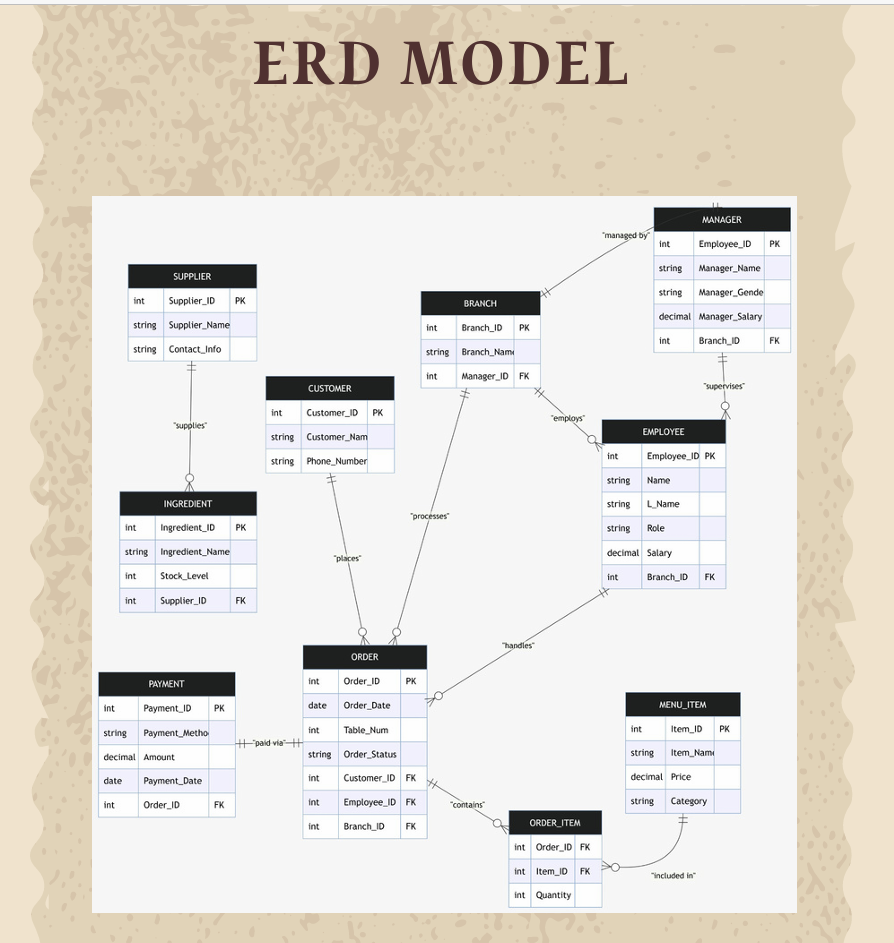
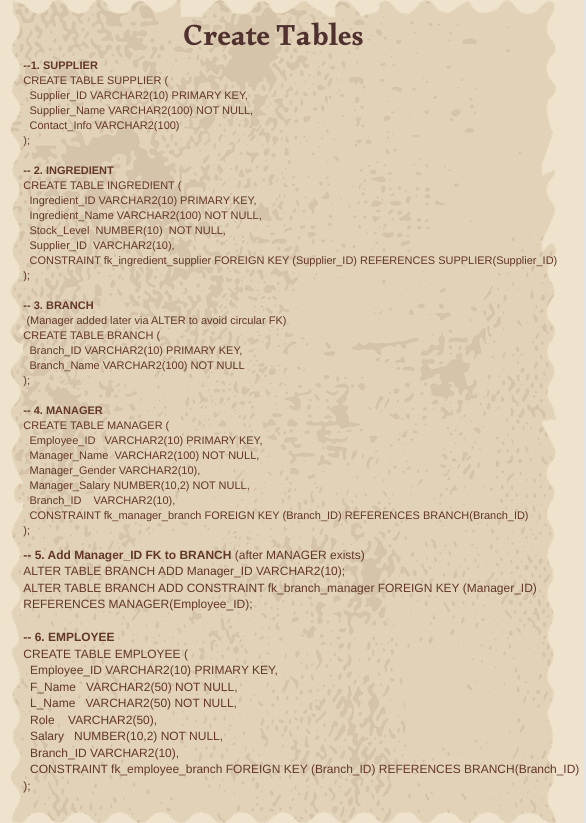
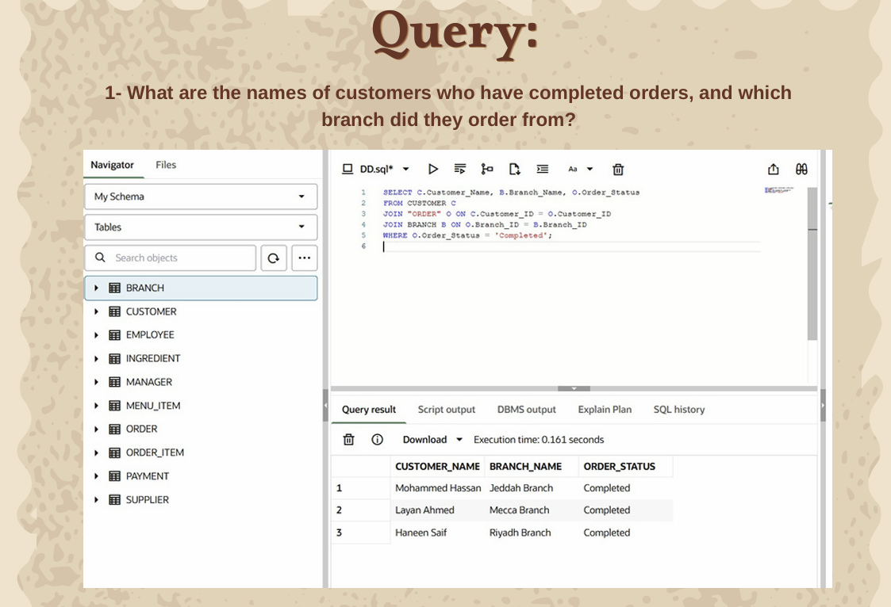
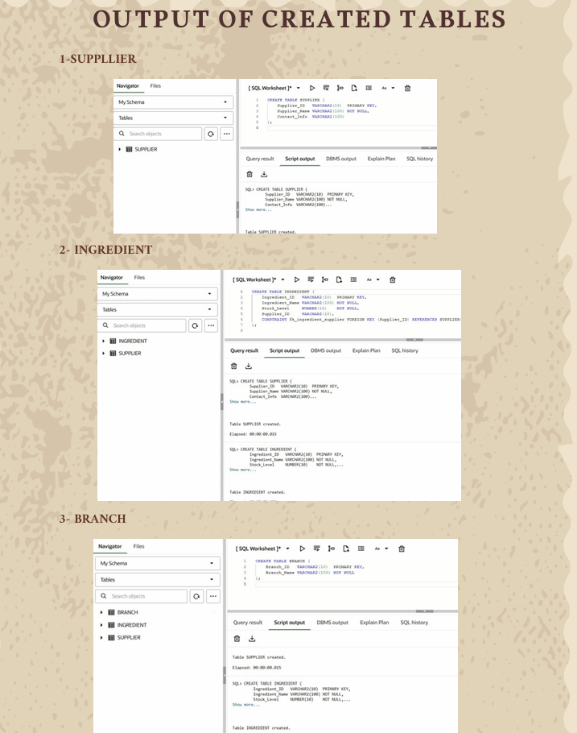
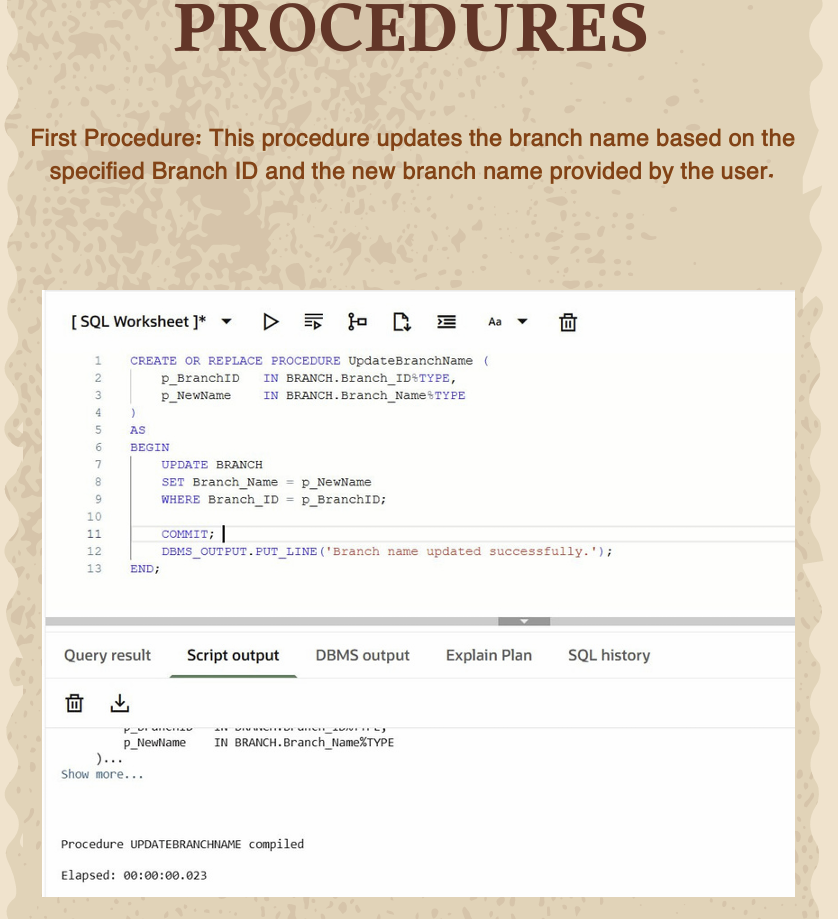
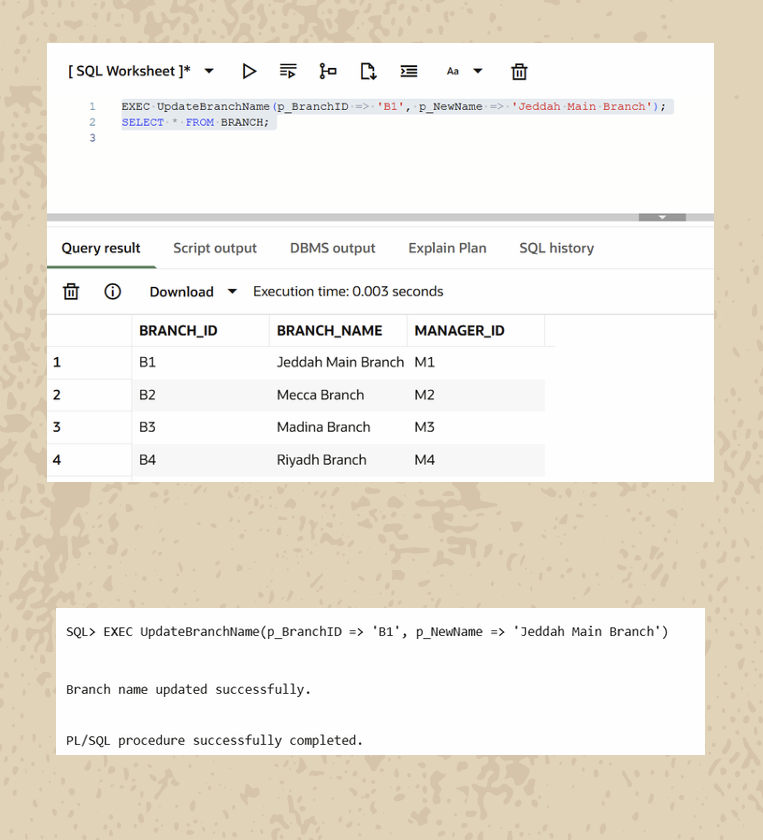

 Cafe Management System

A relational database project developed for the Database Systems course. This project focuses on designing and implementing a complete database for managing café operations using SQL.

The system covers the full database development process, including:
- Database requirements analysis
- Business rules and entity identification
- ER Diagram (Conceptual & Logical Design)
- Database normalization
- Relational schema mapping
- SQL table creation with primary and foreign keys
- Data insertion and retrieval
- SQL queries (JOIN, GROUP BY, ORDER BY, Aggregate Functions)
- Stored Procedures

* Features
- Customer management
- Employee and manager management
- Branch management
- Menu and order management
- Payment tracking
- Supplier and ingredient management
- Database reports and analytical queries

* Technologies
- Oracle SQL
- SQL
- Relational Database Design
- ER Modeling

  Project Report
📄 [View Full Report](CAFE_MANAGMENT_system.pdf)

ER Diagram

Create Tables

 SQL Queries

 Query Output

 Stored Procedure

Procedure Output

This project was completed as a university team project for the *Database Systems* course.
